# Process Journal - Tung Cao

This is the process journal of Tung T. Cao the programmer in the group.

First thing first, I do unserstand that a journal should be written as things happened not after. So instead of trying to fabricate this journal as if I was written it that day, I will just be straight forward and say that it was written after all the events had happened. As such, this is not much of a journal but rather my own reflections, assetments and even explaination of how and what I did ? looking back at them. __Well with all things, however, there is always an exception, an outliar if you will, and that would be the "Initial Thought" section because that was written at that time.__

This journal will be written from sprint to sprint. The reason for that is because we worked closely with each other during the project so by writing from meetings to meetings would be quite difficult. Of course, all the important events such as Playtest session, milestone presentation or break points in the process of making this game will be included as well.

As the programmer of the project, most of my sprints are revolved around programming tasks. At least, until after the milestone presentation where I am more involve with the Narrative design of the game. Also near the end, I started to redesigned the level so it makes sense gameplay-wise while coordinating with our environment artist for a more artistic view on the game. 

So in the end, I guess, I can say that I am Programmer, a Narrative Designer and a Level Designer.

---
### Before The final protype

For the final prototype for True story class, Me and Chris decided to work together on this one. One of the many reasons is that we had already decided before the semester even started that we were going to work together with Chris being at the helm. 

It was a logical decision since  Chris wanted to be the vision keeper for this semester and I, who was vision keeper for 2 previous semesters, was kind of worn out. I didn't understand the role of the vision keeper and most of the time, it seemed more like just project management. 

I wanted to focus more on game design and game programming on this semester and less on the managing people side of game development. 

Thus, me and Chris had a conversation about what the game should be and it was clear then that he wanted was an Open world Role playing game. Though we had a glimpse of the story we wanted to tell, The story about the grandma and Krstoslav. Said story would be combined with a simple combat gameplay (Sword fighting) to create the game.

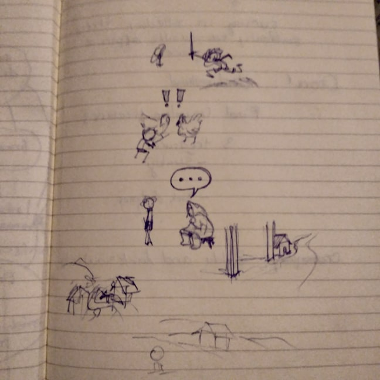

We also came up with the goal of the player in the game as well. The inital goal, was not a treasure hunt but rather trying to collect these memoirs of the grandma after she had passed away. Of course, we didn't want to show in directly but via sub-text in the game.

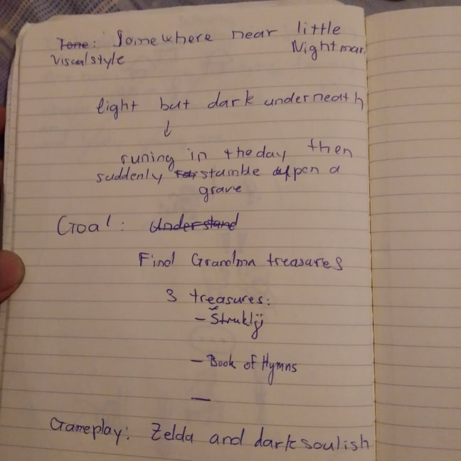

 I believed we lacked a unique game mechanic. It was weird at the time, how can our game be lacking of uniqueness ?. We had a very cool and unique story, not to say that a story about a child and his grandma had never been told before, but the context and the details are fairly our own.

I didn't understand. I felt that the game was lacking, boring if it didn't have its own unique gameplay but so is Zelda. Zelda has a unique story, sure, just like ours and its gameplay was pretty straight forward. It is basically you using your weapon to defeat some enemies in your path. So I didn't know why hitting enemies in Zelda felt different, as in a different experience, from hitting enemies in dark soul or the witcher. 

With that said, I did texted Chris and let him known, on the weekend, that the game was lacking said gameplay feature. Though, to be honest, I couldn't come up with any game mechanic or gameplay that is fun and unique to cope with our story and basic combat during that week, so I instinctually pushed the task of thinking of it to him, since he was the vision keeper afterall. It was one of those mistakes, as a game designer, that I really regret making.

---
### Initial Thoughts (Wednesday, 16th October 2019)
Just finished writing all readme files. It makes the bitbucket repository a better place to live in with all the readmes rather than the wasteland of code and resources. Though some of the readmes need to be look at by the whole team like Readme for the overview of the project, readme for the process, to do list, ...

Was trying to decide whether Hacknplan or Trello is a better choice. Trello can be linked with bitbucket rather easy. Cannot say the same for Hacknplan, however. At the end, I choosed Hacknplan cause it looks cooler.

Setting up the code documentation using doxy gen was rather easy. Though not all files are documented, I will do so as I have to touch them in the project. Rather dissapointing when I can't open the index.html file on bitbucket to view the code documentation. 

The project, overall, seem to be ambitious. The project has like 10 weeks left and I think atleast 3 weeks is needed for polishing. That leave us with around 7 weeks for production. The 3 big coding tasks, as I can imagine in my head, should be the combat system, the Quest system and the AI for the monster. I think the combat system, which should look somewhere like zelda, Breath of the wild or Pine, can be done in 2 weeks of time. The question system can be done in 1 week and the AI should be done in 2 weeks. Which leave me 2 weeks left to make all the other stuff like the Menus, in-game UIs stuffs, fixing bugs....

---
### First meeting (Thursday, 17th October 2019) 

As the name suggest, this was the very first meeting we had since the forming of the group on the previous True Story class which was on a tuesday. 
We basically decided on the things needed for the first playtest. 
They were mostly basic game mechanics and game animations that was gonna be there regardless of the project such as combat system and some fighting animations. 
We also did all the technical stuffs such as naming convention, management tools, What everyone's jobs and roles was in the project. More can be read in the [To-do](../to-do.md).

Good news is, I had written most of the thing we discussed in the to-do file inside the project. 
Bad news is that I had written the to-do for only that meeting. My thought process was that with hacknplan as out management task, the to-do will be obsoleted. Whether it is true or not, I guess, can be seen in this "Journal" because only the first meeting was written based on the to-do and the others based on hacknplan.

---
## Sprint #1 (October 16th to November 4th, 2019)

---
### First Half (October 16th to October 28th)

This sprint lasted quite long, since it was because it is a combination of the first meeting, the drafting week where we were concepting ideas for the game. And we were running late at the end, since the 2nd sprint was starting when this sprint was still going on.

For me though, the first haft of this sprint, I was working on the combat system in the game. I did create the task for the combat system and later realized that is was very ambiguous. I mean, the task was literally called "Combat system". What kind of combat system ?, How should it feels ?, can we dodge or roll ?, Is there attack animation cancel ?.  

Well, I did later on add a different task called the "Character an change combo and hit things". Which was a bit clearer than just "Combat System". Though, it sill sucked.

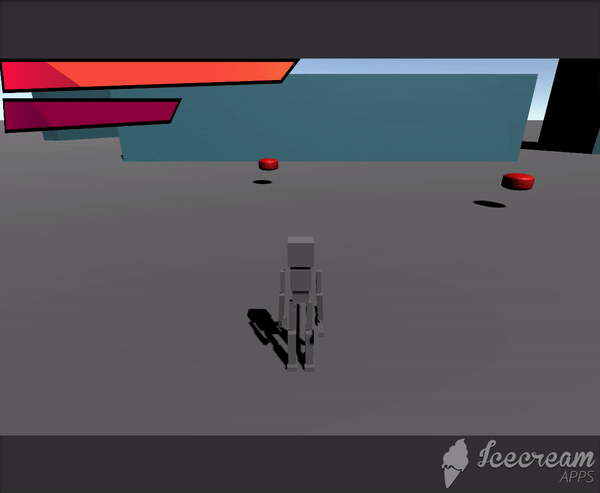
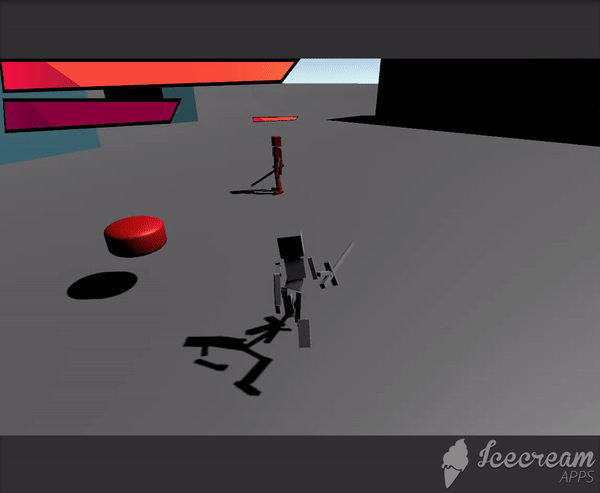

#### A Better Setup
Though, it was not said in the previous semester but I had already developed a different setup than most people do for all of my Unity Project.
The setup aimed to reveal as much information as possible to the user (as in Unity editor, as in Me). 

One of my grudges with having a normal set up is this:

This is so claustrophobic, it is hard to find information from this. You are either forced to add more code into one script or you can add more scripts into one object which would lead to the same problem. 

And if you see the above on unity, what can u really tell about the game object. How many scripts are running in it ?.

As such, unless absolutely necessary, I would never add script straight to the object that it is affecting.

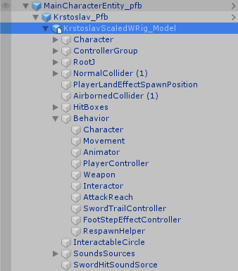

So all of the scripts, affecting the host object, would be in the Behavior node and each script in one object. Each of them will have a  Host object reference back to the game object that it is affecting. Like the example above, One can tell how many scripts are running on KrstoslavScaledWRig_Model.

It is, by no mean, a perfect system and there are still many limitations that I am trying to work around it. One of these limitations are physic callbacks and finding the script in in the game object.

#### Miscellaneous 

Other than that, I also added this really cool thing. If there is a missing reference in a script in a gameobject then an angry emoticon will appear next to the game object in the hierarchy. 
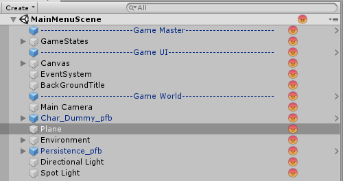

To be honest, we didn't use it that much because it causes too many random errors and not work as intended.  Something to develop next semester I guess.

All these preparation was for the first playtest session which was going to happen on the 22nd of October, which was the week after that week. More on the review of that playtest can be see below.

#### Playtest session #1 (Tuesday, 22nd October 2019)
Thinking back about it, I think it was unnecessary because it kind of defeats the goal of a playtest session which is to test certain gameplay elements. What did testing the combat system and some attack animations helped us with the design of the game. We all had certain expectations of what the combat should be or ought to be. Unless we introduced something new about said combat system, which we did not, there was not really any purpose of playtesting it. 

It is a good learning experience for future projects, playtests should have a purpose of actually testing actual elements in the game. Either it is a completely new elements or a combination of old elements that we want to see if it actually works . 

---
#### Second Half (October 28th to November 4th)
For the second half, which started on the 28th of October, I worked on the Inventory System, Pickup items and I did fix the jittering of the camera movement.

##### Inventory System (Finished November 2nd) 
For the Inventory system, I designed it with the MVC model in my mind at the time. I didn't draw the design for it, unfortunately, but the same design would later on be apply for the quest system in the game. 

It basically has a Inventory System class, Inventory UI Manager Class and Inventory class. Where the Inventory system class handles all the flow of data from Inventory itself to the UI manager and vice versa while the Inventory handles the process of the data and the Inventory UI manager handles all the showing of said data to the screen. 

And the result :

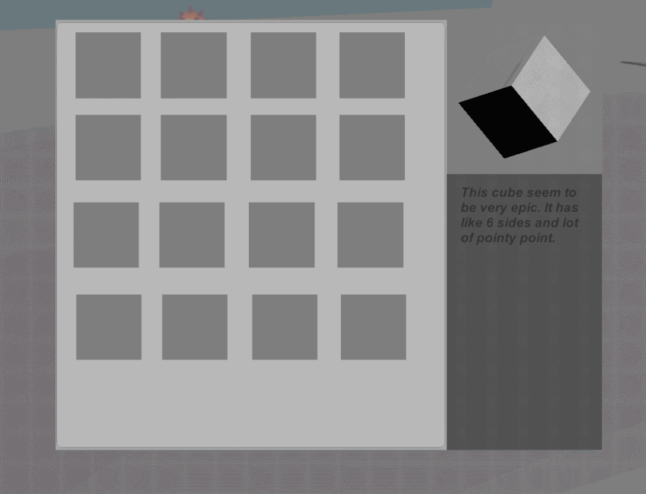

For the 3d cube in the inventory, I used a different camera viewing it from the distance. The camera does not render it to the screen but rather to a render texture. To which having an image on the canvas drawing the rendered texture instead. It was quite cool at the time.
##### Picking Up Items (Finished November 2nd)

I was trying to mimic the design in zelda at this point in time.

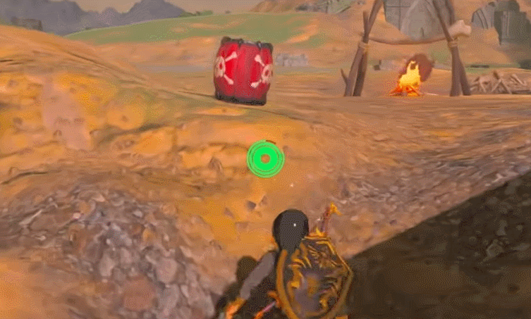

The pickup item was pretty straight forward where you collect the item's data then send it to the Inventory System. The Problem, believe it or not, resides in who is suppose to be showing the pick up text in the game and where should the pick up text be. 

Should the InventoryUIManager shows it ? or should I add a script inside the character to show it, since that script would had more information on how and when to show the pick up text. Mainly because there's a trigger collider event for whenever an item enter its range. As such it is easier to send this signal to something inside the character rather than some god manager in the scene. 

Both of them could works, of course. It is just the matter of the correct responsisbily of these objects. Ended up using the small interaction script inside the character instead. 

The decision was made because we also going to have the talking to NPC. It is also an interaction that need a text to highlight it. Furthermore, the Inventory UI Manager shouldn't be worrying about interaction with the NPC.

A lot said just for this:

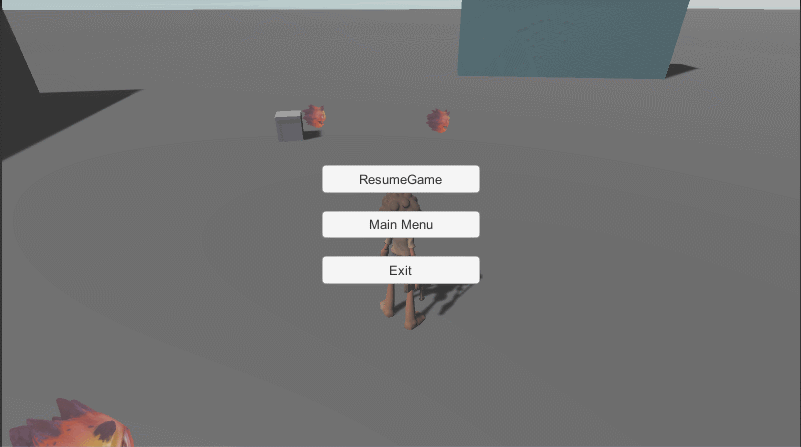

##### Fixing the Jittering on the camera (Finished November 2nd)

Well, I think this image said all that need to be said.

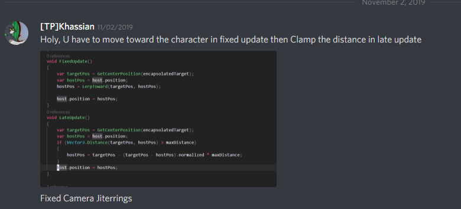

---
## Sprint #2 (October 28th to November 18th, 2019)
One might wonder why was this sprint started while the other sprint was running. This was where we made the first mistake in project management, I would say. Instead of sending tasks that was not finished to the backlog then start a new sprint, we started a new sprint and add new tasks there. This result in some sprints running for a very long time.

For me, though, I did told my team that developing an AI in the game would resulted in 2 weeks of works hence this sprint ran long for me. 

I remember during this week we had an in class meeting where we talked about the project via the big board. I think I had a quite rediculous arguement with Chris about fetch quests and Collect quests. He argued that they are different because one you need to return it and the other you don't. Where I argued that the they are the same, it is just that the sequential steps in completing a quest is just one less.  

Regarding the tasks, There were 3 big tasks that I was able to get done which was the AI behaviour, The Quest System and the integration of attack animations.

Of course, besides that, there are also miscellaneous tasks that I was able to get done as well.
### Questing (Finished Nov 10th)

Well for there to be quest, the player need to be able to talk to the npc first to get the quest. Well, I would be honest here and say that it was a very quick hack and slash implementation since I didn't know the specifics of how the interaction would turn out. It was too far ahead to plan anything concrete at this point so I just did this:

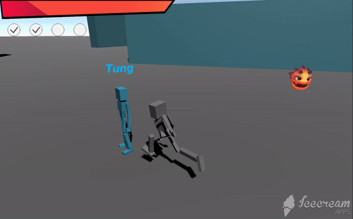

To be really really honest though, I don't remember how I implemented that. It was something with state machine and stuffs. Let's move on...

I was considering my option for how to do the questing system at the time. What is involve in a quest ?. I analized that a quest comprises of the following:
Receiving a quest, doing the objectives and returning of the quest. The objectives can varies and the returning of quest can be optional too. 

This is my initial design:

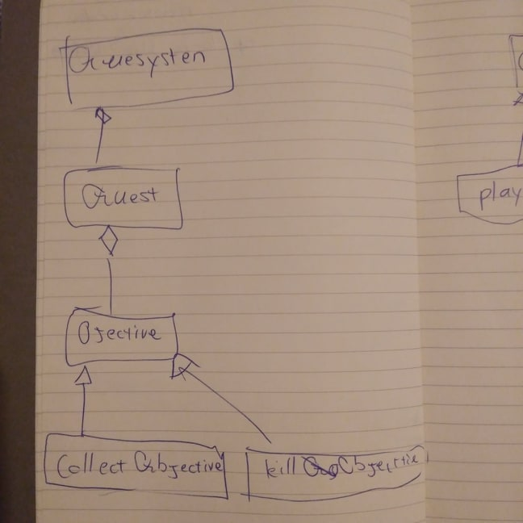

It was quite bare boned with only 2 type of objectives like collect and kill something. 
And I also wanted to seperate the quest system a little bit like the MVC model just like the inventory system. So I expanded it a bit:

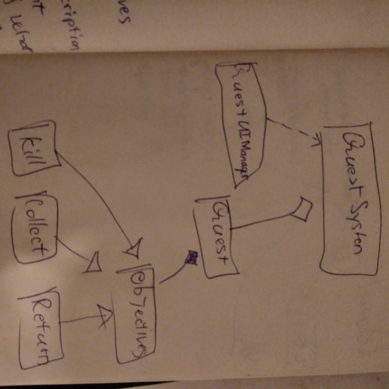

The implementation was straight forward after the design was made since I just needed to follow it. Quest System distributes and receives quest, QuestUIManager
 see the quests in the Quests and show em and the Quests, themselves, has a list of objectives that when all return trues then the quests are done.

 
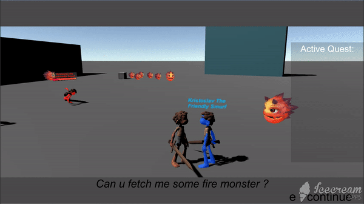

### Let's there be Intelligence (AI Behavior or behaviour)  (Finished Nov 16th)
Now, for this task I would like to split it into 3 sections. The controller, The behaviors themselves and the pathfinding. 
#### The Controller
Ever since I thought of __The Setup__ above, I always been thinking of how should I control a character in the game. I used to combine the Input for a character and the behavior of the character themself into one gigantic character script.

I stopped doing that since it always creates trouble  whenever I approach the AI. Moreover, I had always been thinking of changing the character I control in game and if I made a huge script then it wouldn't be impossible.

Then I thought of controlling a puppet instead. You know, no matter the puppet if I rig it with string I can control it. 

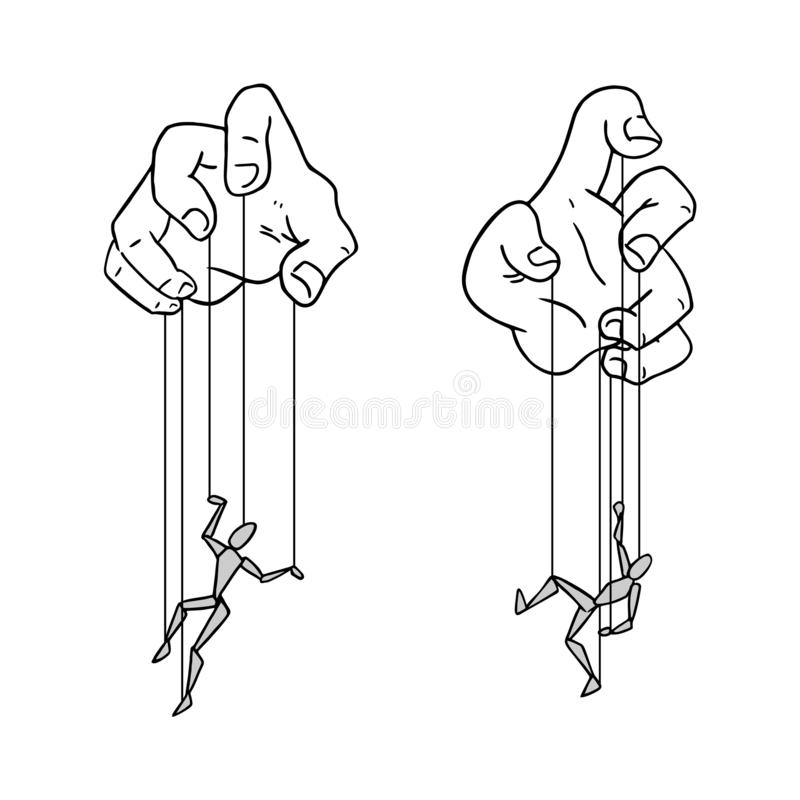

So I started to look at the character script not as the big script where I do all my character related things. I began to split it into different parts. 

We have the controller part, the character and it's behaviors. This is not the same as the behaviors that I'm gonna talk about in the next section, however. What I meant is moving, attacking, jumping, e.t.c. 

I did separate some of the character's behaviors but I gotta say it was not worth it due to complexity reason.

On the other hand though, seperating the input and the character did wonders.

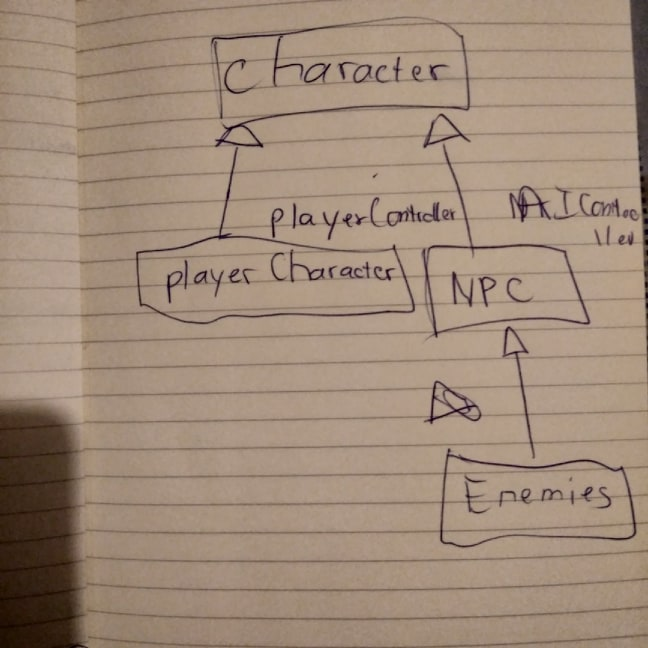

Where the player controller will control the character and the character do what the character do without knowing who is controlling it.

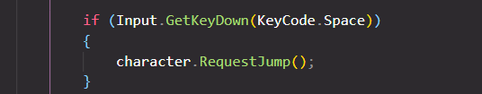

so if I want my character to jump I just request jump then the character will check if he can jump. If he can he will jump, otherwise he will not. This is extremely useful since the controller doens't need to know all the nuisances like when can this character jump, how does this character jump and so on. Same can be apply for attacking, rotating and moving.

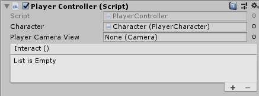

#### The Behaviors
The behaviors are the decisions that the AI made in the game. For example, whether he should continue to chase a target or should he return to patroling.

To achieve these behaviors in game. I choosed to follow [Unity's Pluggable AI](https://www.youtube.com/watch?v=cHUXh5biQMg&list=PLX2vGYjWbI0ROSj_B0_eir_VkHrEkd4pi) for a couple of reasons. 

One of them is because it is pluggable. In the game, the Ai can do the 2 following things: He can make decisions and he can do actions.

The amount of actions that he can do depends on his current state.
With each decision, he can change into a different state or stay in his current state.

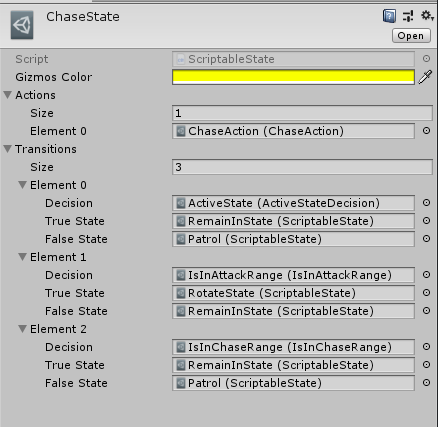

In this example, we are in the chase state, as such, the action that we will perform would be the Chase action. Of course, a state can do more than one action if so desired. 

After each action, it will run through all the decisions that it can make. In this case The ActiveState decision decides whether chasing action is still possible. In our case, it is whether the chase target is still alive. Then, if it is true then we will continue chasing by remain in the state. Otherwise, we would go to the patrol state and perform the actions and decisions there.

Of course, because all of these decisions and actions are scriptable  object, so is the state itself. We have the freedom to create, drag and drop to change the behavior of our AI. [Pluggable AI with scriptable Objects]

All of that just for this broken thing: 

#### The pathfinding

One would think that this might be the easiest thing to do in the game, since unity has its own pathfinding system such as Agents and the Navmesh. The problem with using the unity's agents is that the agent dictates the movement of our game object or character. 

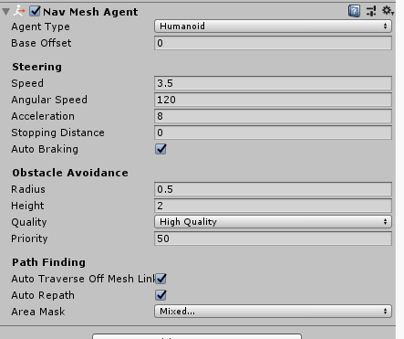

We didn't want that because we had our own movement system that was already implemented. So It was such a hassle to use the Navmesh just to calculate the path in the game. You have to [sample the postion](https://docs.unity3d.com/ScriptReference/AI.NavMesh.SamplePosition.html) and it will return the list of path. 

The problem, here, lies where the path that it returns doesn't factor in the character width and height. At the time, I was not that familiar with the Unity Navmesh agent so I didn't know and still don't know how to fix this problem. 

Another problem is that since I was not using the agent, the character couldn't avoid each other in the game which led to me just putting in an obstacle component for all of the monster in the game. 

Well, after all of that, it worked 70% of the time so it was good enough.

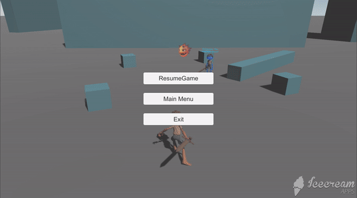

#### Miscellaneous 
Other than that, I added Chris's character animation in the game such as run, walk and attack which can be seen above. Then I fixed some bugs where the attack animation did not sync with hit box. 

Which can be seen below:

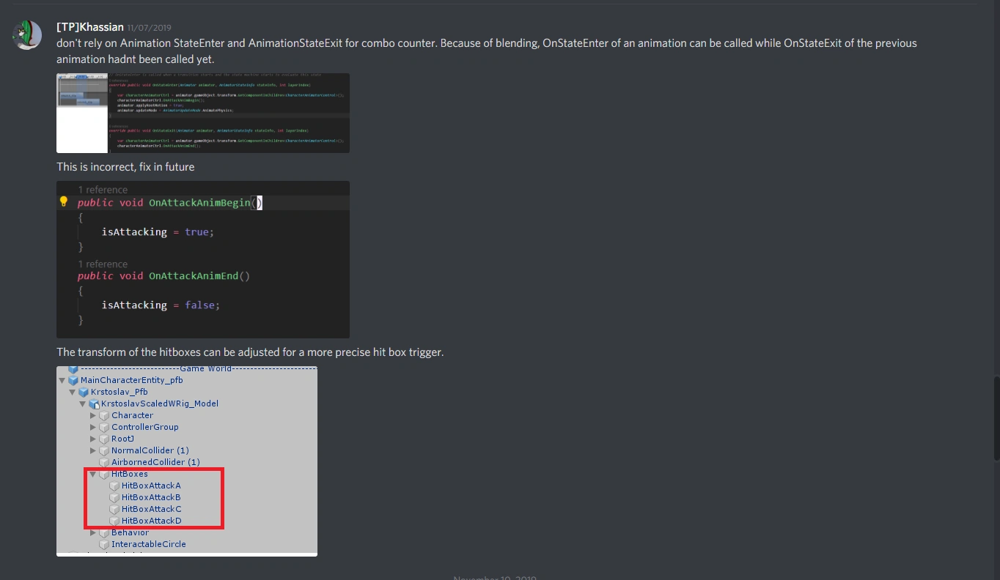
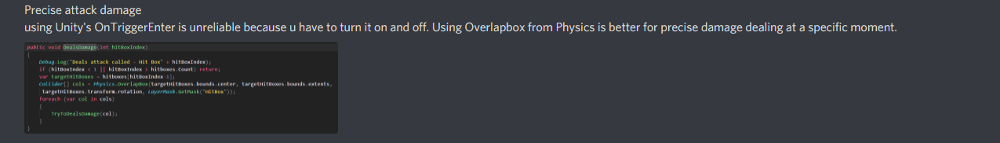

---
### Project Week (Monday, November 11th 2019 - Sunday 17th November 2019) 
During this period, we had a project week where I attended the illustration workshop called "Future City, 30 years from now". It was quite relaxing to be honest. It was little break from the whole project and just think about something else.

It was pretty cool where I had to design a couple of futuristic building using adobe illustrator. Then we got to talk about what would the future be like and stuff like that.

Well, at the end they promised that they would show a poster of the whole city but I have yet to seen it. Furthermore, I found out that I absolutely, completely hate adobe illustrator. I uninstalled it the moment the workshop was done.

In conclusion, Love the class, hate the tools.

---
### Playtest Session #2 (Tuesday, 19th November 2019) 

For this playtest, Sarah finished with her terrain during  and it was quite cool. The feeling of putting the monsters and their functions in the scene after it being developed in a gray box for more than a month. AND it worked as intended. It was so satisfying.

After this playtest, everyone was just chillin' for a couple of days then do the presentation for the Milstone presentation. I think that was the reason why most of the stuff for the playtest evening was resolved on November 22nd. 

Though, on the darker side of things, we wasted another playtest evening just like playtest #1. Same problems and still no anwser. Since, I was kind of focusing the technical side of things, the problem slipped my mind.  

---
## Sprint #3 (November 4th to December 3rd, 2019)

Feels kind of like the movie "Memento" now since we are going back in time again. Well as said earlier, for me sprint #2 and #3 are intertwine since the development of the AI in the was expected to be this long.

I think sprint #3 started, for me, on November 22nd more or less. Not thing eventful or cool to talk about unfortunately. Mostly because it was about putting the system in sprint #2 and #1 in the game for the playtest session #2.

Also, thanks to the speration I did in sprint #2. I found out, after putting the enemy model in the game, that it allows the switching of the character reference at any point in the game and it would still works. Well, since the controller is controlling the character, regardless which character is assigned to it. 

To be honest, though, at the time that I made this seperation. I didn't even think that this was possible. 

So I just pretend that it was all planned out by me.... I am indeed shameless.
Then I just told them, with a proud provado that "you guys are always one drag away from playing anything character in the game". Which was true, since we have this:

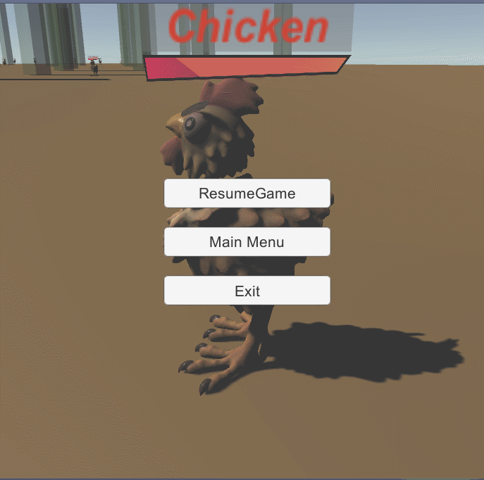

I, also, did some shading shenanigans with the slime since Christ wanted me a slime in the game.  

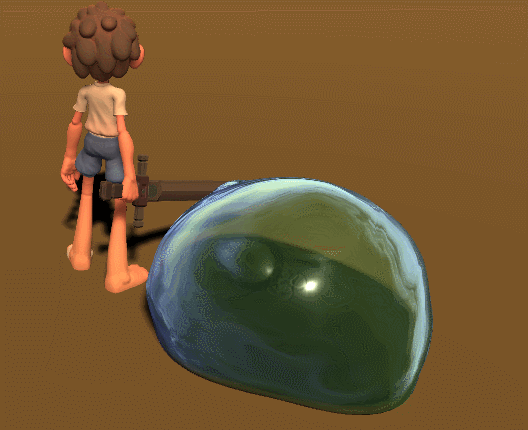

Quite cool if I do say so myself. Though, I don't think we even used it in the end.

---
## Milestone presentation (Tuesday, 26th November 2019)
Here we were, the milstone presentation. I did had problem doing the slides for it, however. Most of the thing I did was code related so I didn't know what to put in my slides. 

If I showed them the thing I did in sprint #1 and sprint #2, would they understand or even care ?. I mean most of them are artists and designers. Even though the thing I did was cool to me, for them it would just be another simple game mechanics that ought to be there. Furthermore, do I even have enough time to present them ?. 

Sometimes, it is just frustrating to be a programmer, really. Most of the thing you do, only fellow programmers appreciates it and people only look for bugs in the thing that you made.

So I just made some slides that relate my implementation with game design concept which I did really researched. One would be amazed, how these simple mechanics that we take for granted in game, is implemented.

Oh well, It is what it is or rather it was what it was, I guess.

On the darker side, again. I did told Chris that it was not gonna went well with the game concept. Again, the looming problem of the game missing an essential part was still there. I did not know whether he understood that or he really thought that the game was ok.

---
## Sprint #4 (November 25th to December 16th, 2019)
The sprints were catching up and we were slowly beginning to be back on track. Since the date different in sprint #3 and #4 is shorter. As in, they were not interwine with each other that much.

This week, Chris came to me with a really cool problem. In the attack animation, he wanted the character to be able to exit the attacking state in the animator and be able to move and jump during the recovery period of the animation.

He suggested that I should calculate the time of the point of recovery during the attack animation and allow the player to exit from there.

When I first hear his suggestion, I paused and was like "yeahhh, we're not doing that". I was like that because if one ever work with animator before. One would know that getting the timming during the animation, via code, is really complicated... or to me they were. 

Since trying to know when the player is in attacking animation was difficult for me because animation doesn't just transition between each other instantly but rather blend with each other. 

So I suggested a different solution, how about we splitted the attack animation into 2. In one animation state, we would allow transition out of and in the other not. That was quite a simplier implementation of the problem and he did not had to modify the attack animation much.

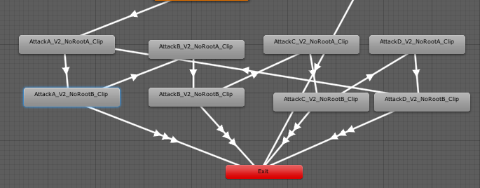

So when the character attack, the attack animation is in RootA. The recovery of the attack animation would be in RootB. In RootA, we would not allow any exiting of the state unless to recovery. From recovery, we would allow exiting to all states.

We talked about the implementation further and reached the above aggrement on which state should the player be able to rotate, jump, move,... 

I don't think we could had gotten this solution if I didn't know any thing about modeling/animation and He didn't understand code and the animator. This, ingenious, solution was accomplished because of both of our knowledges in both field.

Before this point,  whenever I worked with an artist, it was more or less they gave me assets and I put it in the game. It was cooperative, yes, but for me it was "cool, you gave me some assets I can use". This was the first time that I ever feel a cooperative connection with an artist to accomplish something in the game.

And the result cannot even show with a gif or an image, One has to actually go into the game and play it to feel it. It is a very subtle detail in the game. It solved the problem in the second playtest where the character feels static when attacking. 

---
## Sprint #5 (November 30th to December 16th, 2019)
Well, sprint #4 and #5 ended on the same time. At that point, I realized that it was a problem where our sprints kept interwine each other so I talked to everyone and suggest that we should resolved everything in sprint #5, at best sprint #6.

Though, for this sprint, I was, again, just  putting in the stuff I did from the previous sprints in the game such as implementing more enemy animation in the game. Which after, implementing two, the others would just fall into a pipeline.

### The Journey to Narrative design. (First Draft finished December 9th)

Since, it is hard to come up with an out of this world, special game mechanic. I thought it would be better to start doing the narrative design.  Mostly, because I thought that everyone had a very vauge impression of what our game would look like in the end. For example: where we starts, how the game gonna progress step by step. 

We did talk about it earler but it was: boy woke up -> boy open a treasure map -> boy pick up his sword -> boy go adventure. 

Then again, there was no clear steps to tell the story of Krstoslav and his grandma. So me and Chris talked about it and the story he wanted to tell, once again. This time and would wrote the step by step of how the player can gather these treasures or items. 

We aggreed that having animated cutscene was an unlikely possibility. We decided to go with a drawn cutscene instead.

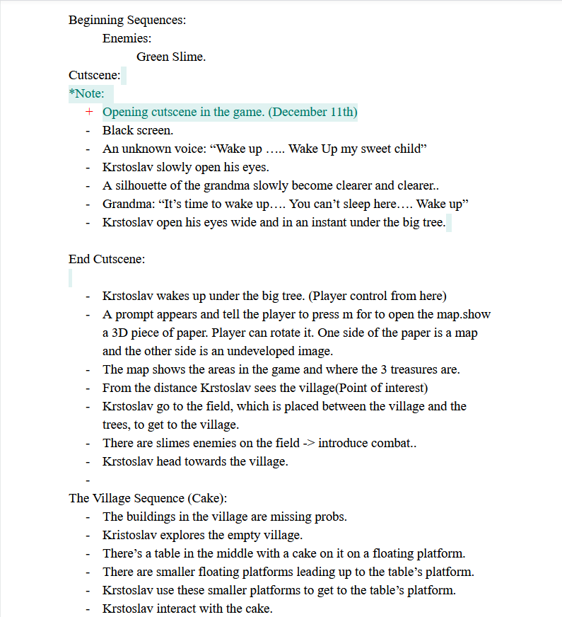

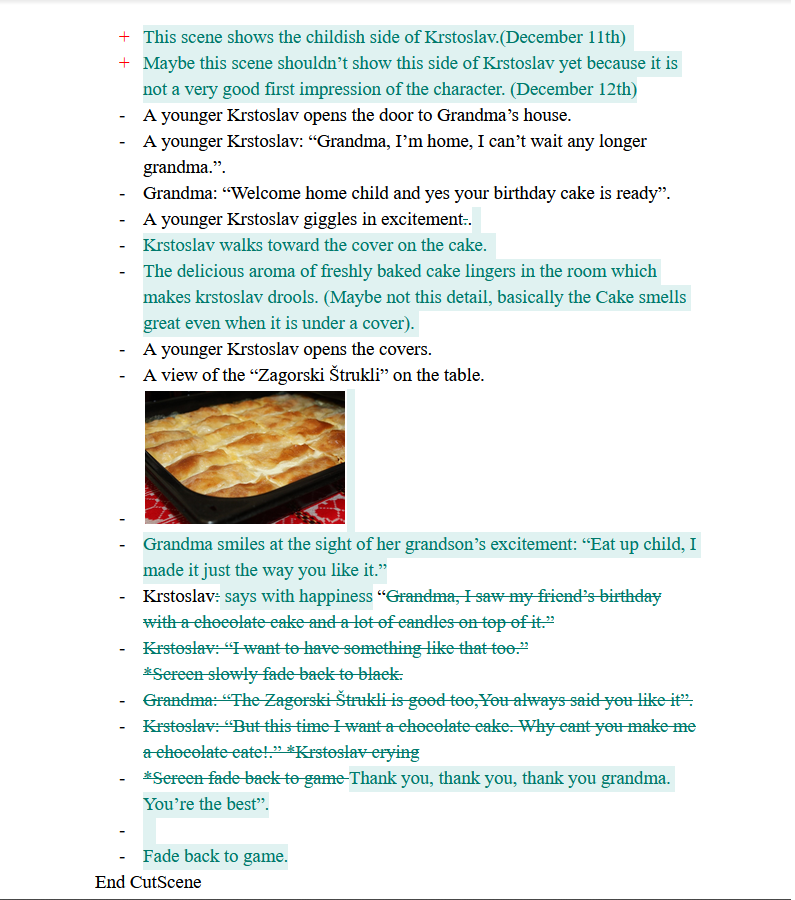

Sometimes, with these things, people might not  get the intention of the scene so I added some text saying the intention of the cutscene. Which was really cool, because when people understand what you are trying to do then they give very productive feedbacks.

For Chris, all he needed to understand was the context of the cutscene. I clearly told him that he did not have to draw the cutscene line by line by rather contextual.

This was the start of my official involvment in the narrative design. Of course, these thing that I wrote was not set in stone. It needed to go through Chris for vision keeping (not go compeletely crazy with the story) and artistic decisions of the cutscene. 

---
## Sprint #6 (December 9th to December 16th, 2019)

It was brief but this week I had to go hard back to the world of programming since assets are being done and features are being requested. I had to combined assets to prepare for the next playtest as well. 

I added screenshake on attack, fixed the slopes problem (which I don't remember how I fixed it) and putting them in the scene. Even though the level was different, as said before, after you put them in twice (the gray box and the 2nd play test), everything just fell into a pipeline. Nothing to really talk about.

One of the feature that was noticable was the enemy move forward when they attack without using root motion. I thought it was gonna be difficult but in the end it was not that difficult. 

You just had to do a sphere cast to find all the enemy surrounding the player. Calculate their angles with respect to the player's forward direction to see which one is in front. Then the player would just try to move toward that enemy. Same principle would applied for all enemy character.

It worked 70% of the time so it was good enough......

Unfortunately, didn't have much time to work on the narrative of the game during this period. 

---
## Playtest session #3 (Tuesday, 17th December 2019) 
During this playtest, we actually got to test something. We got a lot of feedback from the different testers. 

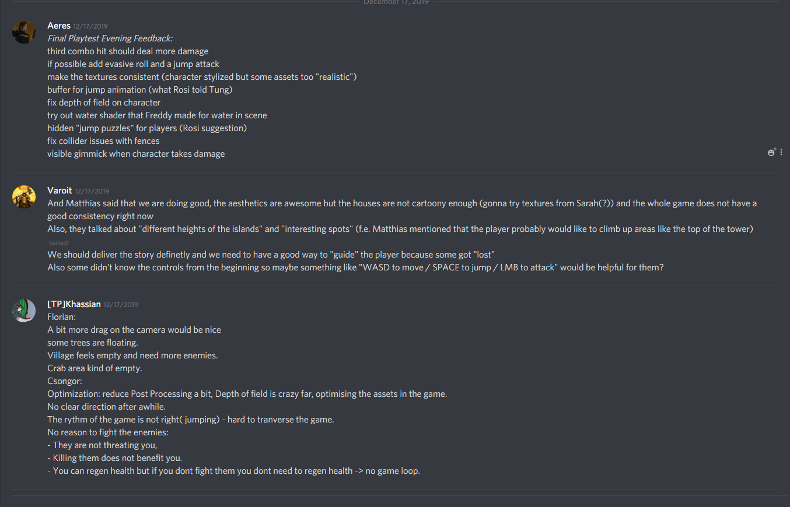

I noticed that some of the problem in the game can be fixed via level design. For example:  some areas feels empty, rythm of the game for the jumping puzzle, enemies has no meanings,...

Which at the time, was on my agenda, the moment I finished writing for all the cutscene.

---
## Sprint #7 (December 16th, 2019 to Jan 3rd, 2020)
Needed to add the year. How annoying!. 

This sprint ran right through Chrismas break for me. As in, I didn't really care much about Chrismas since in Viet Nam, we don't take that long of a break during Chrismas and my family is not here anyway.

During this period, I only worked on the narrative of the game. I focused and wrote the Music box cutscene and the sweater cutscene. It was rather hard to tell the story of Krstoslav and the grandma, I realized.

### Planning the Narrative Cutscenes
To write an emotional story, the players need to somehow be attached with the main character or the protagonist. There were so many restrictions. 

Such as we can only have 5 cutscenes and 2 of them were set in stone (the beginning and end cutscene). 

+ The other 3 cutscense shouldn't had more than 4 panels, due to time reason.
+ The middle cutscenes need to show the characteristic of the protagonist and grandma. 
+ It should show their connections and conflicts. 
+ Not to mention,the scenes should not be in any particular order

So I kind of sketched out this board and try to identify what I wanted to write for the 3 middle cutscenes, before I wrote any words.

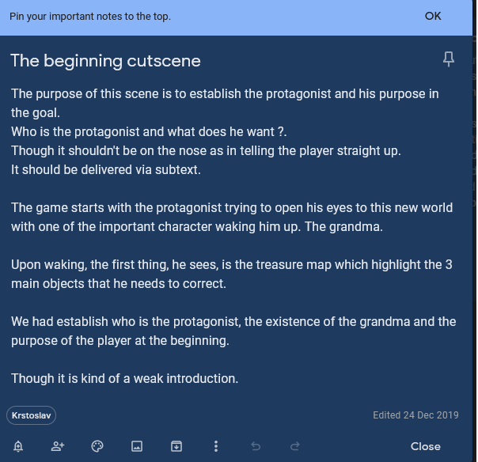

Though, we kind of miss the treasure map in the end.

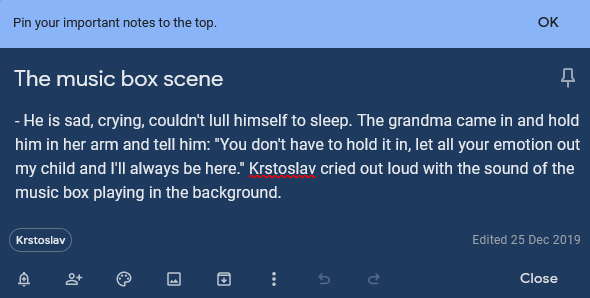

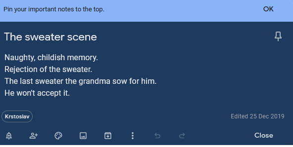

#### The Music Box Cutscene

Out of all those note, I was only able to write for the music box cutscene, at first.

I quickly realized that even though I would really prefer to write like above. It was very hard for Chris to draw the cutscene because of the amount of context needed to be translated. 

I even tried to draw storyboards for the cutscenes but since it'd been so long since I last drew that it was .... questionable. Maybe I should takes art again next semester or start drawing random storyboard again.

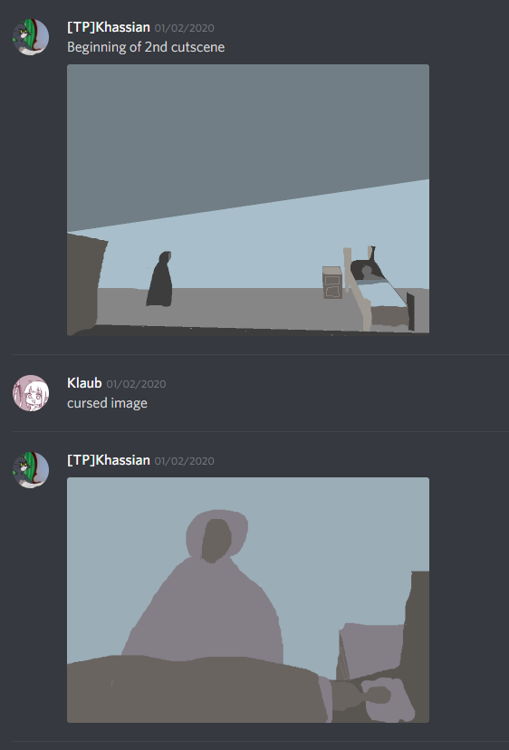

So we talked together and try to figure out how we can compact this into a cutscene.

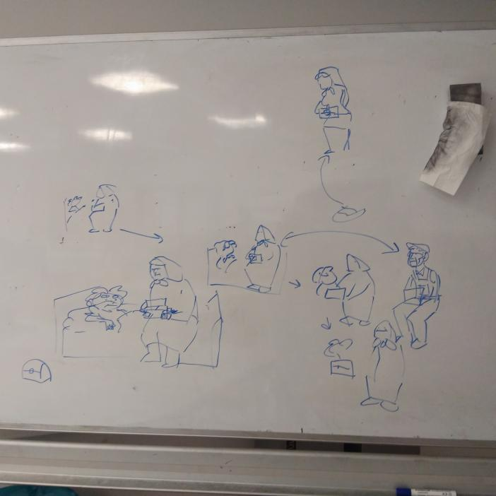

At first, we thought that switch Krstoslav position with the young grandma and the old grandma with her mom. We instantly realized that it would create confusion if we do that. Thus we decided to change the "mom" from the "dad" instead. 

#### The Sweater Cutscene
It was switched out of to a different idea where Krstoslav would make and give the sweater to the grandma so that it shows Krstoslav's  love for his grandmother. This was due to me felt like Chris's vision wouldn't like the idea that Krstoslav being a jerk which would lead to the players hating the main character. Furthermore, I beleive that it would be too much without any previous scene building up to it. 

Learning from my mistake with writing for the music box cutscene, I promptly switch to a more screenplay style. 

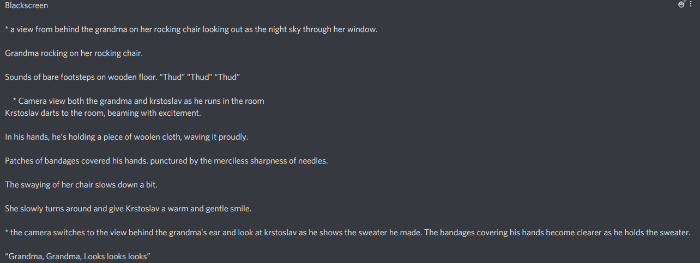

Which Chris aggreed that it was ok since there were not that much detail and he could use his artistic view and drew it in his own way.

Though I did read up different camera position and stuffs in film making to wrote that. At the end, he changed it all to his style. It was quite heart breaking but I digest.

---
## Final Sprint #8 (December 16th, 2019 to Jan 3rd, 2020)

---
### Conclusion (Unidentify date)

