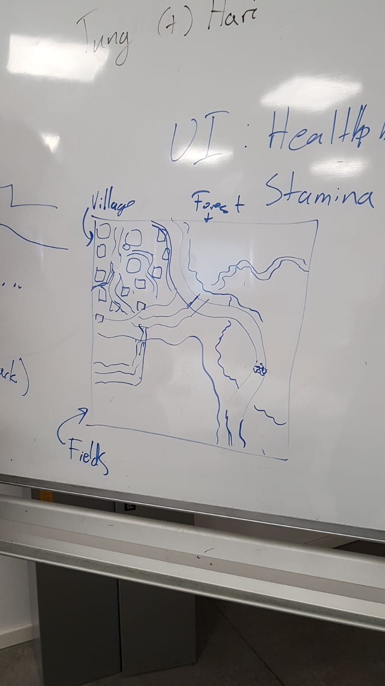

## Actual To Dos, None of This Tentative Bullshit

* On Wednesday: Release the game

---
### Bugs and Other Changes In Code

_If you found any bugs in the game then add them to this list_

---

### 23 October 2019 (After the first play test)
#### Bugs

- ~~Enemy Health bar rotate toward the character instead of the camera.~~
- When attack, sometimes it doesn’t do damage.
- ~~When attack, it deals too much damage.~~
- ~~Camera stuck when rotate too much.~~
- ~~Character play run animation when being pushed.~~
- ~~Character collider got stuck to his surroundings.~~
- ~~Character stuck in jumping animation.~~
#### Other changes
    
- ~~When moving, rotate toward the move direction not the camera look direction~~.
- ~~Make the dangerous objects look more intimidating~~
- ~~Smaller collider while jumping.~~
- Change stamina to dots instead of precise bar.
---
### To do
- ~~Meeting on Thursday, 17 October 2019 at 12:30 am~~. 

---

### (17 October 2019 at 12:30)

- Goal something for the playtest.

    - ~~Combat system (Tung, Tuesday 22 October 2019).~~
        - Not actually done, The character can attack but there's no AI and the Ai doesnt hit back.

    - ~~Fighting Animation(Chris, Monday 21 October 2019).~~

    - ~~Basic UI (can be done easily).~~
        - Added health bar.
        - The stamina bar is just changing the color of the health bar.

- Unity Version: 2019.2.6f1.

- Long term:.

    - ~~Layout of the map (Chris)~~.

    

    __Original Map Layout__

    - Design(environment design and layout) of the layout of the areas.

        - Village (Freddy, 28 October, 2019)
        
        - Forest (Sarah, 28 October, 2019)

        - Field (Hari, 28 October, 2019)

    - Main Quest:. 

        - Find the treasures: (Music box, Sweater, Picture).

    - Side Quest:.

        - Area dependent.

    - Naming Convention:.

    Tree:

        - Model: tree_model. 

        - Animation: tree_anim.

        - Texture: tree_tex.

        - Material: tree_mat, tree_leaves_mat, tree_bark_mat .

        - Prefab: tree_pfb.
        
    - Commit: 

        - Summary.

        - List of changes.

---