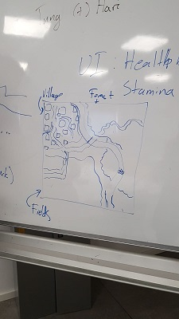

## Actual To Dos, None of This Tentative Bullshit

* On Wednesday: Release the game

---
### Bugs

_If you found any bugs in the game then add them to this list_

- Wait for it

---
### To do
- ~~Meeting on Thursday, 17 October 2019 at 12:30 am~~. 

---

### (17 October 2019 at 12:30)

- Goal something for the playtest.

    - Combat system (Tung, Tuesday 22 October 2019).

    - Fighting Animation(Chris, Monday 21 October 2019).

    - Basic UI (can be done easily).

- Unity Version: 2019.2.6f1.

- Long term:.

    - ~~Layout of the map (Chris)~~.

    

    __Original Map Layout__

    - Design(environment design and layout) of the layout of the areas.

        - Village (Freddy, 28 October, 2019)
        
        - Forest (Sarah, 28 October, 2019)

        - Field (Hari, 28 October, 2019)

    - Main Quest:. 

        - Find the treasures: (Music box, Sweater, Picture).

    - Side Quest:.

        - Area dependent.

    - Naming Convention:.

    Tree:

        - Model: tree_model. 

        - Animation: tree_anim.

        - Texture: tree_tex.

        - Material: tree_mat, tree_leaves_mat, tree_bark_mat .

        - Prefab: tree_pfb.
        
    - Commit: 

        - Summary.
        
        - List of changes.

---